# Publishing a Website with GitHub Pages and a Custom Domain — Without Touching DNS

Namecheap is a popular DNS domain registrar. Publishing a website or web app to the
internet almost always involves registering a domain and configuring it to point to
wherever the site is hosted. That process can be daunting, especially for less
tech-savvy users.

The DNS protocol has a handful of basic concepts, but it can quickly turn into a
rabbit hole. Letting an AI assistant handle the details is a real advantage.

Conveniently, Namecheap offers an [API for managing domains](https://www.namecheap.com/support/api/intro/),
which lets you automate tasks — and lets AI assistants do the DNS management work for you.

In this post, I'll buy a cheap domain, stand up a GitHub Pages site, and wire the two
together using GitHub Copilot CLI and a Namecheap skill — without editing a single DNS
record by hand.

## Step 1: Enable Namecheap API access

Go to **Profile → Tools**, scroll to the bottom under **Business & Dev Tools**, and
click **Manage** under the *Namecheap API Access* subsection.

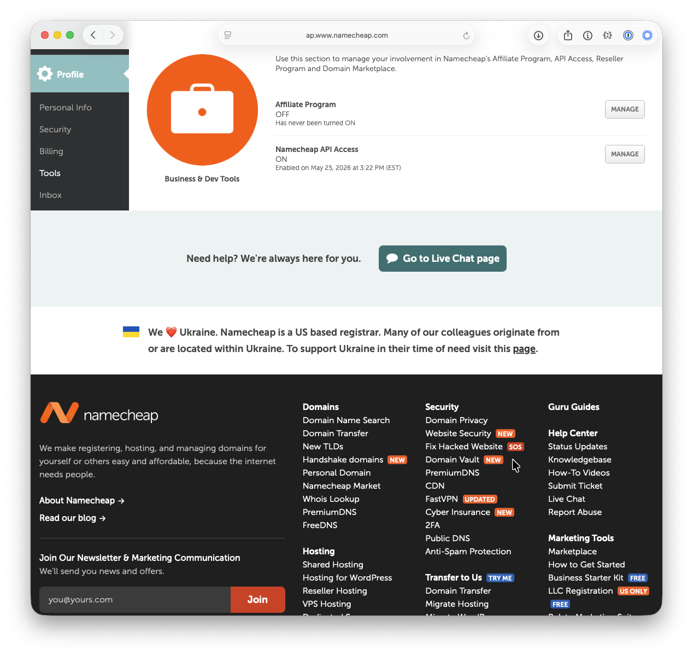

A shortcut is to log in and navigate directly to
<https://ap.www.namecheap.com/settings/tools/apiaccess/> (this URL may change in the future).

On the API access page:

1. Toggle the API to **ON**.
2. Add the public IP address of the machine that will connect to the API to the list of **Whitelisted IPs**.
3. Copy and save the **API Key** somewhere safe for later use.

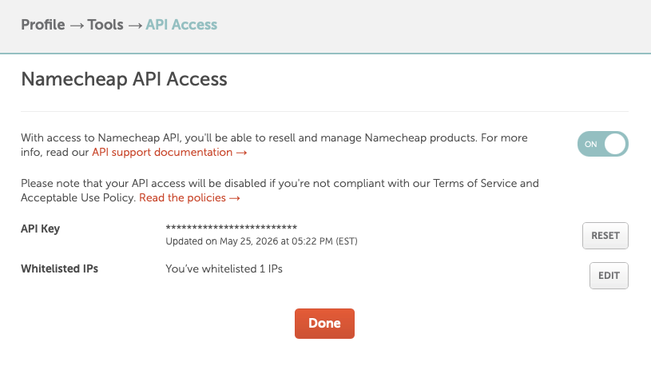

With that, we can automate managing domain names in Namecheap.

## Step 2: Install the Namecheap skill

To drive Namecheap from an AI assistant, enable the
[Namecheap skill](https://github.com/brunoborges/namecheap-skill).

To install it on a machine running GitHub Copilot CLI, run:

```bash
gh skill install brunoborges/namecheap-skill namecheap-dns --scope user
```

The first time you run a command such as *"list my Namecheap domains"*, Copilot
verifies that the skill is configured. On the first run, it prompts for your username:

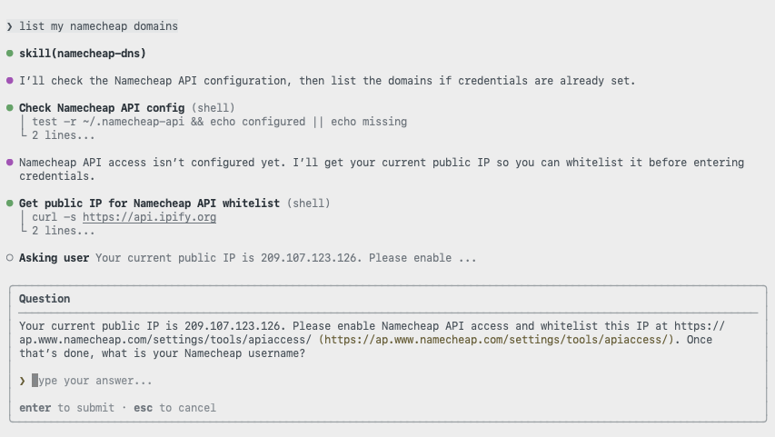

Type your username. Next, it asks for the API key:

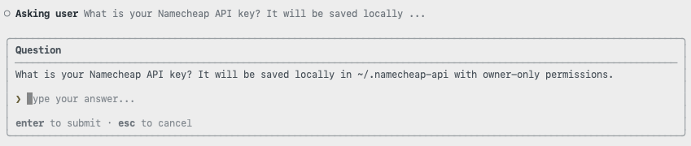

Once everything is set, Copilot returns the list of domains in your account:

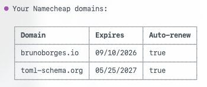

## Step 3: Buy a new domain

For this blog, I bought one of the cheapest TLD (top-level domain) options: `.click`.


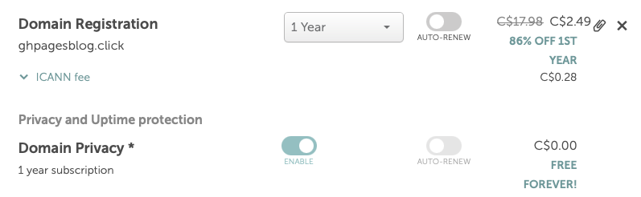

In the end, I paid **USD $2.00** (about CAD $2.46).

## Step 4: Create a repository and enable GitHub Pages

With a domain ready, let's get a website running on GitHub Pages.

First, create a public repository:

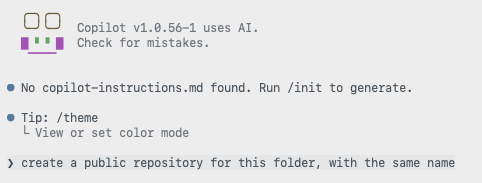

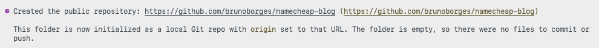

Next, ask Copilot to create a landing page and enable GitHub Pages for publishing:


## Step 5: Point the custom domain at GitHub Pages

Now it's time to use the Namecheap skill:

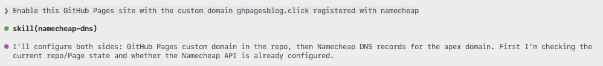

The skill may ask a few clarifying questions:

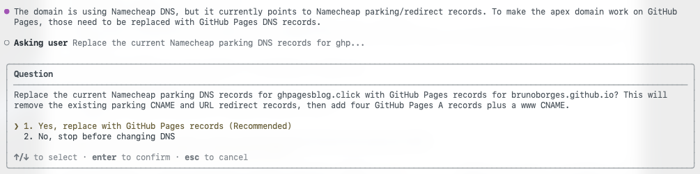

Then it does the heavy lifting of configuring DNS to point at GitHub's IP addresses for
a GitHub Pages custom domain:

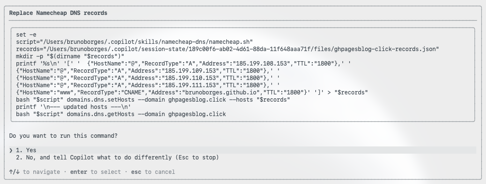

Copilot also handles repository-side details, such as adding a `CNAME` file containing
the custom domain:


## Step 6: Verify the site is live

Copilot then verifies that the domain resolves and serves the site:

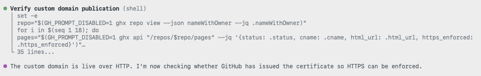

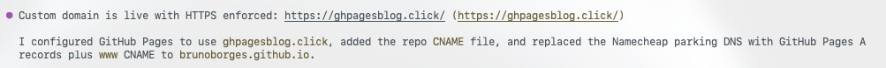

The entire Copilot CLI session is available here:
<https://gist.github.com/brunoborges/167c988a0c4c16b8ccffca995ae98ce2>

The domain was purchased at **11:21:27 AM EDT**.


After everything was set and done, the website was live at around **11:35 AM EDT**:


## Conclusion

That's how easy it was to configure GitHub Pages with a custom domain. From buying the
domain to a live HTTPS site took roughly 15 minutes — and I didn't have to touch any DNS
configuration myself. The combination of GitHub Copilot CLI and the Namecheap skill
turned a traditionally fiddly process into a short conversation.
