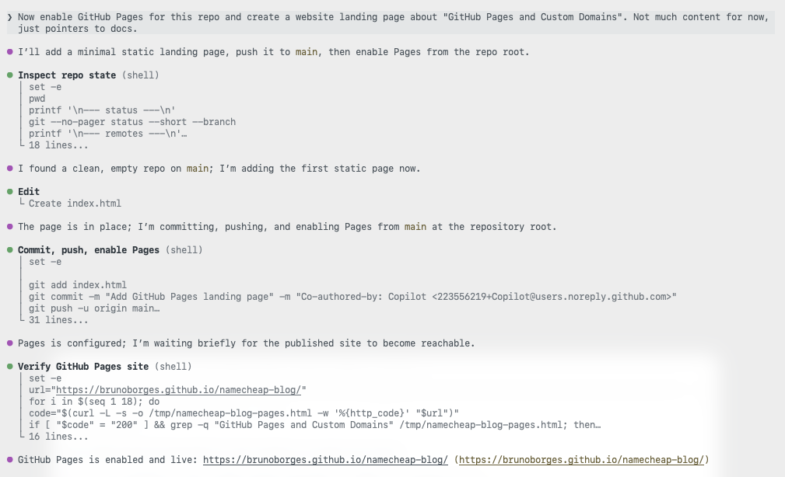
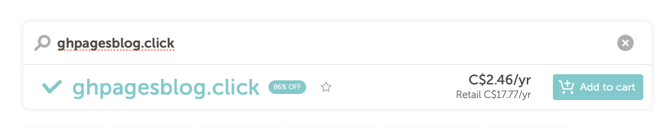
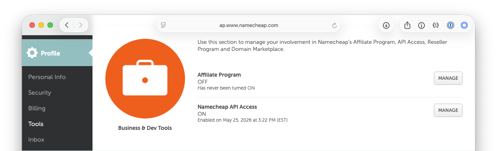
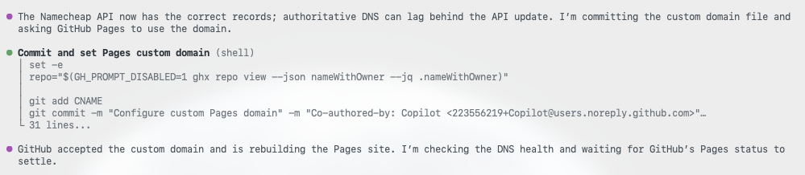
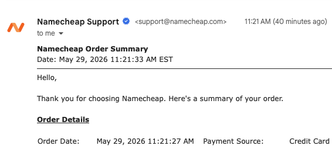
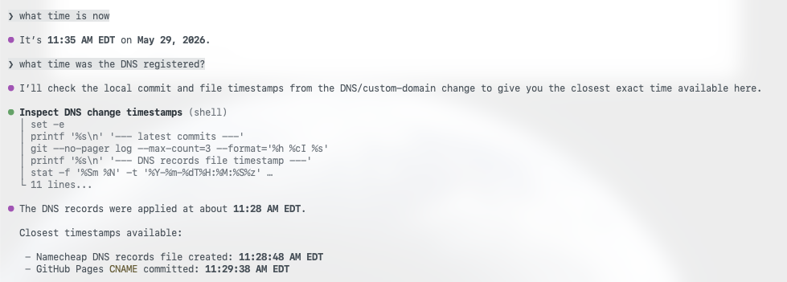

# Add a custom domain to GitHub Pages with GitHub Copilot CLI

Custom domains make a project feel real. But for many developers, the last mile, DNS, is also the most frustrating: `A` records, `CNAME` entries, TTLs, and that long wait where you're never quite sure if the internet is broken or you are.

In this post, I'll walk through how I took a project from an empty repository to a live website on a custom domain, secured with HTTPS, in about 14 minutes, without manually editing a single DNS record. The trick is to let [GitHub Copilot CLI](https://docs.github.com/copilot) drive the work, with a community [Namecheap skill](https://github.com/brunoborges/namecheap-skill) handling the DNS automation through the registrar's API.

Here's what you'll learn how to do:

- Publish a site with [GitHub Pages](https://docs.github.com/pages)
- Register an inexpensive domain
- Enable your registrar's API and connect it to Copilot CLI
- Point the domain at GitHub Pages and verify it end to end

Let's get started. ⤵

## What you'll need

- A GitHub account (the free tier works)
- GitHub Copilot CLI, installed and authenticated
- A Namecheap account, for buying the domain and using its API

No prior DNS expertise required. That's the whole point.

## Step 1: Publish a site with GitHub Pages

Every deployment needs something to deploy, so start with a home for the site: a new public repository.


With the repository in place, you don't have to hand-write an `index.html`, commit it, and then click through the Pages settings yourself. Instead, describe the outcome you want to Copilot CLI and let it create the landing page and enable GitHub Pages for you.



The site is now live on a `github.io` URL. That's a solid start. Now let's give it a proper address.

## Step 2: Register an inexpensive domain

You don't need a premium `.com` to ship a side project. For this walkthrough I chose one of the cheapest top-level domains available, `.click`, and searched for an available name.



`ghpagesblog.click` was available, so I moved to checkout.


The total came to **USD $2.00**, or about **CAD $2.46**. That's a low-risk price for trying a custom domain on a side project.

## Step 3: Connect the domain to GitHub Pages

This is the step developers tend to dread. Here, an AI assistant does the repetitive work while you stay in control of the decisions.

### Enable Namecheap API access

Before Copilot CLI can update your DNS, you need to turn on Namecheap's API. In your Namecheap account, go to **Profile → Tools**, scroll to **Business & Dev Tools**, and select **Manage** under *Namecheap API Access*.



You can also navigate directly to the [API access settings page](https://ap.www.namecheap.com/settings/tools/apiaccess/) (note that this URL may change over time).

On that page, complete three steps:

1. Toggle the API to **ON**.
2. Add the public IP of the machine that will call the API to the IP allowlist (Namecheap labels this field **Whitelisted IPs**).
3. Copy the **API Key** and store it somewhere safe. You'll need it shortly.


> For more detail on what the API offers, see [Namecheap's API introduction](https://www.namecheap.com/support/api/intro/).

### Install the Namecheap skill

Next, give Copilot CLI the ability to talk to Namecheap by installing the [Namecheap skill](https://github.com/brunoborges/namecheap-skill). It's a single command:

```bash
gh skill install brunoborges/namecheap-skill namecheap-dns --scope user
```

The first time you ask Copilot to do something like *"list my Namecheap domains,"* it confirms the skill is configured and prompts you for your username.


Then it asks for the API key you copied earlier.


With credentials in place, Copilot returns the list of domains in your account. It's a quick way to confirm everything is wired up correctly before making any changes.


### Point the domain at GitHub Pages

Now connect the domain to the site. Ask Copilot to configure the custom domain using the skill.


A good automation asks before it acts. The skill pauses to confirm the change before touching any records.


Once you approve, it replaces the existing parking records with the GitHub Pages `A` records and a `CNAME` for the `www` subdomain, which is the exact configuration GitHub Pages expects. This matches GitHub's documented steps for [configuring a custom domain for your GitHub Pages site](https://docs.github.com/pages/configuring-a-custom-domain-for-your-github-pages-site).


It also handles the repository side, committing a `CNAME` file that tells GitHub Pages which custom domain the site should answer to.



> **Not using Namecheap?** The same approach works with any registrar that offers an API. You don't need a purpose-built skill: point Copilot CLI at your registrar's API documentation and ask it to read, understand, and use that API to set the GitHub Pages records for your domain. The registrar changes; the workflow doesn't.

## Step 4: Verify the deployment

Rather than assuming success, Copilot CLI checks its own work. First, it confirms the domain resolves.


Then it confirms the site returns a healthy HTTP 200 response.


If you'd like to review every prompt and response, the [full Copilot CLI session is available as a gist](https://gist.github.com/brunoborges/167c988a0c4c16b8ccffca995ae98ce2).

Now for the timeline. The domain was purchased at **11:21:27 am ET**.



The site was live on the custom domain, served over HTTPS, at around **11:35 am ET**. That's roughly **14 minutes** from owning nothing to a fully deployed site, including API setup, skill installation, DNS configuration, propagation, and verification.



## Wrapping up

DNS isn't hard, exactly, but it's fiddly, easy to get wrong, and slow to give feedback. By pairing GitHub Pages with GitHub Copilot CLI and the Namecheap skill, the repetitive parts of a custom-domain deployment fade into a short conversation: you make the decisions and approve the changes, and the tooling handles the plumbing.

If you've been putting off a custom domain because the DNS step feels like a chore, this workflow removes the friction. To go further, explore the [GitHub Pages documentation](https://docs.github.com/pages) and the guide to [configuring a custom domain for your GitHub Pages site](https://docs.github.com/pages/configuring-a-custom-domain-for-your-github-pages-site), then try it on your next project.
